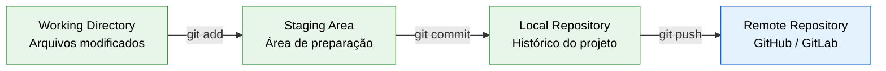

# 🧠 **Modelo Mental do Git**

Para entender como o Git funciona, é importante visualizar **as diferentes áreas pelas quais uma alteração passa até virar parte do histórico do projeto**.

O Git organiza o trabalho em quatro etapas principais:

* **Working Directory**
* **Staging Area**
* **Local Repository**
* **Remote Repository**

---

## **Visão geral do fluxo**



---

## **Working Directory**

O **Working Directory** é a pasta do seu projeto onde você cria e modifica arquivos normalmente.

Exemplo:

```text
meu-projeto/
 ├── README.md
 ├── script.py
 └── dados.csv
```

Quando você altera um arquivo, o Git detecta a mudança, mas **ela ainda não faz parte do histórico do projeto**.

---

## **Staging Area**

A **Staging Area** é onde você escolhe quais mudanças irão para o próximo commit.

Você adiciona arquivos usando:

```bash
git add arquivo.txt
```

ou

```bash
git add .
```

Pense nela como uma **área de preparação para o commit**.

---

## **Local Repository**

Quando você executa:

```bash
git commit -m "mensagem do commit"
```

as alterações da **staging area** são registradas no histórico do projeto.

Cada commit representa um **ponto específico no tempo** do seu projeto.

---

## **Remote Repository**

Para compartilhar seu código com outras pessoas, você pode enviar seus commits para um repositório remoto.

Isso é feito com:

```bash
git push
```

Os repositórios remotos normalmente estão hospedados em plataformas como:

* GitHub
* GitLab

---

## **Fluxo típico de trabalho**

No dia a dia, o fluxo de trabalho mais comum é:

```bash
editar arquivos
git add .
git commit -m "mensagem"
git push
```

Esse ciclo se repete continuamente durante o desenvolvimento de um projeto.

---

## **Dica importante**

Use frequentemente:

```bash
git status
```

Esse comando mostra em qual etapa do fluxo seus arquivos estão:

* modificados (**Working Directory**)
* preparados (**Staging Area**)
* registrados no histórico (**Repository**)
