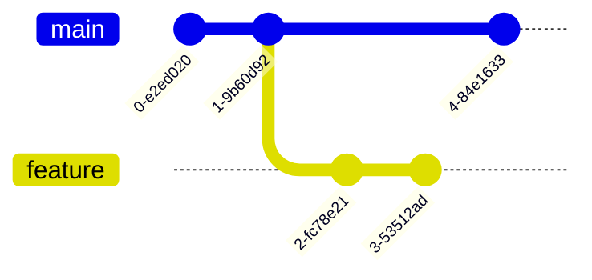
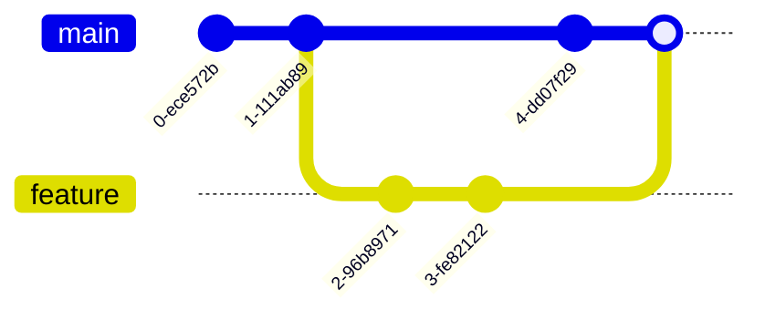
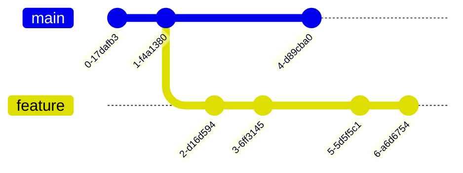

# 🔄 Merge vs Rebase

Quando duas branches evoluem separadamente, o Git precisa **integrar as mudanças** entre elas.

Existem duas formas principais de fazer isso:

* **merge**
* **rebase**

Ambas têm o objetivo de combinar alterações, mas **funcionam de maneiras diferentes**.

---

# 🌿 Quando branches divergem

Considere o seguinte cenário:

* a branch `main` continua recebendo commits
* uma nova branch `feature` foi criada para desenvolver uma funcionalidade



Agora temos **duas linhas de desenvolvimento**.

Para integrar essas mudanças, podemos usar **merge** ou **rebase**.

---

# 🔗 Integrando mudanças com merge

O **merge** combina duas linhas de desenvolvimento preservando o histórico original.



O Git cria um **merge commit** que conecta as duas branches.

Exemplo de comando:

```bash
git checkout main
git merge feature
```

### Características do merge

* preserva o histórico original
* mostra claramente quando branches foram integradas
* é seguro para trabalho em equipe

---

# 🔀 Integrando mudanças com rebase

O **rebase** reescreve o histórico movendo commits para uma nova base.

Em vez de criar um merge commit, os commits da branch são **reposicionados após os commits mais recentes da `main`**.



Exemplo de comando:

```bash
git checkout feature
git rebase main
```

Após o rebase, os commits da `feature` passam a parecer como se tivessem sido criados **depois dos commits mais recentes da `main`**.

---

# 📊 Comparação

| Operação | O que acontece                                   |
| -------- | ------------------------------------------------ |
| `merge`  | combina históricos mantendo a estrutura original |
| `rebase` | reescreve o histórico para deixá-lo linear       |

---

# ⚠️ Regra prática importante

Uma regra comum em equipes de desenvolvimento é:

```
Use merge para integrar branches compartilhadas.
Use rebase apenas em branches locais.
```

Ou de forma mais simples:

```
Nunca faça rebase de commits que já foram publicados.
```

Isso evita problemas quando várias pessoas trabalham no mesmo histórico de commits.

---

# 🧠 Quando usar cada um

**Use `merge` quando:**

* estiver integrando trabalho de várias pessoas
* a branch já tiver sido compartilhada
* quiser preservar o histórico completo

**Use `rebase` quando:**

* estiver organizando commits localmente
* quiser um histórico mais linear
* ainda não tiver publicado a branch

---

# 📚 Resumo

```
merge  → preserva histórico
rebase → reescreve histórico
```

Ambos são úteis, mas devem ser usados **no contexto adequado**.
