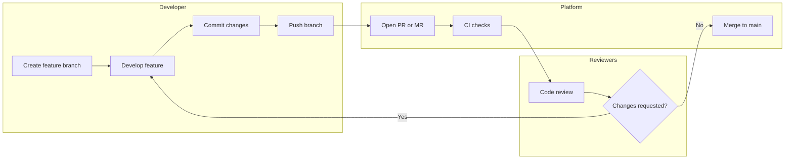

# 📡 Módulo 03 - Collaboration

Neste módulo você aprenderá como colaborar em projetos utilizando Git e plataformas de hospedagem de código.

Enquanto o Git fornece os mecanismos de versionamento, plataformas como **GitHub** e **GitLab** oferecem ferramentas que facilitam o trabalho em equipe, como revisão de código, gerenciamento de tarefas e integração contínua.

Este módulo apresenta fluxos de colaboração baseados em **Pull Requests** e **Merge Requests**, além de boas práticas para trabalhar em equipe.

---

## Estrutura do módulo

Este módulo está dividido em dois submódulos:

- [GitHub](./github/README.md)
- [GitLab](./gitlab/README.md)

*Escolha a plataforma que você utiliza (ou estude ambas para ampliar seu conhecimento).*

---

## Objetivos deste módulo

Ao final deste módulo você será capaz de:

- entender fluxos de colaboração baseados em branches
- abrir e gerenciar Pull Requests ou Merge Requests
- realizar revisões de código
- utilizar issues para organizar tarefas
- colaborar de forma eficiente em projetos de software

---

## Como usar este módulo

Recomendamos:

1. Ler este README para entender os conceitos gerais de colaboração.
2. Seguir o submódulo da plataforma que você utiliza.
3. Fazer os exercícios práticos disponíveis em cada submódulo.
4. Praticar colaborando em projetos reais ou simulados.

---

## Fluxo de colaboração (Pull Request / Merge Request)

---

**1️⃣ Desenvolvedor**

* cria uma branch de feature
* implementa a mudança
* faz commits
* envia a branch para o repositório remoto

**2️⃣ Plataforma (GitHub/GitLab)**

* desenvolvedor abre um **Pull Request / Merge Request**
* pipelines de **CI podem rodar automaticamente**

**3️⃣ Revisores**

* revisam o código
* podem solicitar alterações
* após aprovação o código é integrado na `main`

---

## Exercício simples para começar

1. Crie um repositório no GitHub ou GitLab.
2. Clone o repositório localmente.
3. Crie uma branch chamada `feature/exercicio-inicial`.
4. Faça uma alteração simples em um arquivo README.md (ex: adicionar seu nome).
5. Faça commit com uma mensagem clara.
6. Envie a branch para o remoto.
7. Abra um Pull Request (GitHub) ou Merge Request (GitLab).
8. Revise seu PR/MR e finalize o merge.

---

## Próximo passo
Escolha a plataforma que deseja aprender:

- 📘 [Colaboração com GitHub](./github/README.md)
- 📘 [Colaboração com GitLab](./gitlab/README.md)
