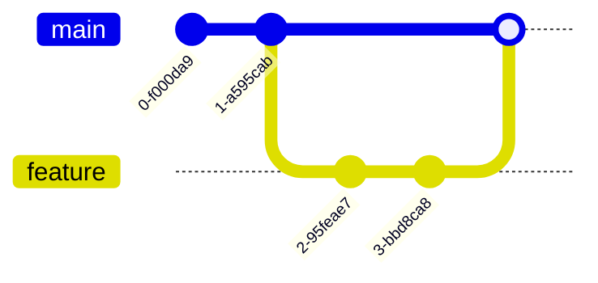
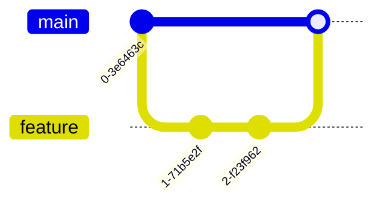
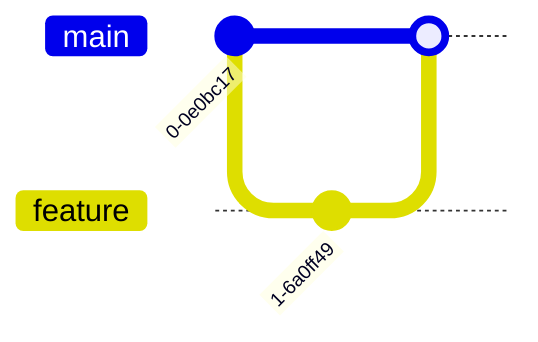
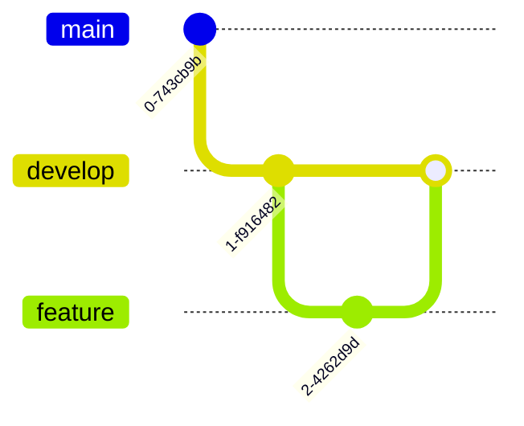

# 🔄 Módulo 04 – Workflows

Neste módulo você aprenderá **diferentes estratégias de workflow utilizadas em projetos reais**.

Um **workflow Git** define como uma equipe organiza o desenvolvimento usando:

* branches
* commits
* integração de mudanças
* revisão de código

Cada equipe ou organização pode adotar um workflow diferente dependendo de fatores como:

* tamanho do time
* frequência de deploy
* complexidade do projeto

Neste módulo veremos alguns dos workflows mais comuns utilizados na indústria.

---

# 🎯 Objetivos

Ao concluir este módulo você deverá ser capaz de:

* compreender o que é um **workflow de desenvolvimento**
* entender as diferenças entre os principais workflows Git
* identificar quando cada workflow pode ser utilizado
* reconhecer como equipes organizam colaboração em projetos reais

---

# 🌿 Feature Branch Workflow

O **Feature Branch Workflow** é um dos modelos mais simples e amplamente utilizados.

A ideia principal é que **cada nova funcionalidade seja desenvolvida em uma branch separada**.

### Fluxo básico

1. Criar uma branch a partir da `main`
2. Desenvolver a funcionalidade
3. Fazer commits na branch
4. Integrar a branch na `main`

### Vantagens

* desenvolvimento isolado por funcionalidade
* reduz conflitos
* histórico organizado

---

# 🐙 GitHub Flow

O [**GitHub Flow**](https://docs.github.com/pt/get-started/using-github/github-flow) é um workflow simples e muito usado em projetos com deploy contínuo.

Ele é baseado no **Feature Branch Workflow**, mas adiciona um passo importante: **Pull Request**.

### Fluxo típico

1. Criar uma branch a partir da `main`
2. Desenvolver a funcionalidade
3. Fazer push da branch
4. Abrir um **Pull Request**
5. Revisão de código
6. Merge na `main`

Esse fluxo funciona bem em projetos onde novas versões são publicadas frequentemente.

---

# 🦊 GitLab Flow

O **GitLab Flow** é semelhante ao GitHub Flow, mas pode incluir **branches adicionais para ambientes ou versões**.

Ele costuma ser utilizado em projetos que precisam controlar melhor o caminho entre desenvolvimento e produção.

### Exemplo simplificado

No GitLab Flow, a integração geralmente ocorre através de um **Merge Request (MR)**.

---

# 🌳 Gitflow

O [**Git Flow**](https://www.alura.com.br/artigos/git-flow-o-que-e-como-quando-utilizar) é um workflow mais estruturado, criado para projetos que possuem ciclos de release bem definidos.

Ele utiliza várias branches principais.

### Branches principais

* `main` → código em produção
* `develop` → integração de novas funcionalidades

### Branches auxiliares

* `feature/*`
* `release/*`
* `hotfix/*`

Esse modelo é mais comum em projetos grandes ou com releases planejados.

---

# 📊 Comparação dos Workflows

| Workflow       | Complexidade | Uso comum                          |
| -------------- | ------------ | ---------------------------------- |
| Feature Branch | baixa        | projetos pequenos ou médios        |
| GitHub Flow    | baixa        | projetos com deploy contínuo       |
| GitLab Flow    | média        | projetos com ambientes controlados |
| Gitflow        | alta         | projetos com ciclos de release     |

---

# 📌 Qual workflow usar?

Não existe um workflow único que funcione para todos os projetos.

O mais importante é que a equipe:

* tenha **um processo claro**
* mantenha **consistência**
* documente suas práticas

---

## ℹ️ Observação importante

Estratégias de branching, padrões de commits e workflows de desenvolvimento **podem variar bastante** entre empresas e equipes.

Algumas equipes usam **Gitflow**, outras preferem **GitHub Flow** ou [**Trunk-Based Development**](https://www.objective.com.br/insights/trunk-based-development/).

Os commits podem seguir **Conventional Commits**, usar mensagens livres ou incluir **IDs de tickets** (ex: `feat(JIRA-123): novo componente`).

O fluxo de trabalho também pode exigir:

* revisão de código obrigatória
* integração contínua (CI)
* políticas de merge
* pipelines automatizados

✅ **Dica:** Sempre consulte as diretrizes da sua equipe ou projeto e adapte-se ao que fizer mais sentido no seu contexto de trabalho.
